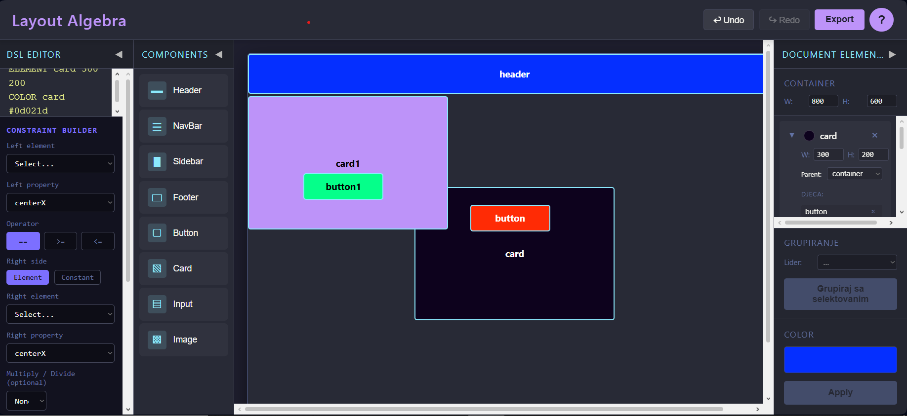

# Layout Algebra - DSL Layout Editor
A constraint-based layout management application developed as a graduation thesis (**Diplomski rad**). The system provides a specialized Domain-Specific Language (DSL) for representing web page layouts through mathematical constraints, variables, and operators.

The application allows users to define layouts using semantic relationships rather than fixed coordinates, offering a powerful logical approach to responsive design.

### Features
- **Semantic Layout DSL**: Define elements, colors, and layout rules using intuitive commands.
- **Constraint-Based Solving**: Real-time layout resolution using the kiwi.js linear programming solver.
- **Visual & Code Sync**: Bi-directional interaction—manipulate elements visually or via code.
- **Advanced Export**: Generate production-ready Absolute, Flexbox, or CSS Grid code directly from your rules.
- **Adaptive Workspace**: Fully resizable and collapsible UI panels (DSL Editor, Components, Document Elements).
- **History Management**: Comprehensive Undo/Redo support for all design actions.
- **CRUD Operations**: Complete management of layout elements and their hierarchical relationships.

### Tech Stack
- **Language**: C# / TypeScript (Core logic)
- **Frontend**: React, Vite
- **Solver**: Kiwi.js (Cassowary Constraint Algorithm)
- **Styling**: Vanilla CSS with modern aesthetics
- **Architecture**: Structured Model-Store architecture for state management

### What I Learned
- **Language Engineering**: Implementing a parser and interpreter for a custom layout DSL.
- **Constraint Programming**: Integrating mathematical solvers into real-time UI environments.
- **Application Architecture**: Designing a scalable state-managed application with undo/redo capabilities.
- **Advanced UI/UX**: Creating a complex, resizable editor interface with professional-grade responsiveness.
- **Export Logic**: Translating logical constraints into standardized CSS layout models.

---
<<<<<<< HEAD
=======

>>>>>>> origin/master
*Graduation Project - Nedim Omanović*
